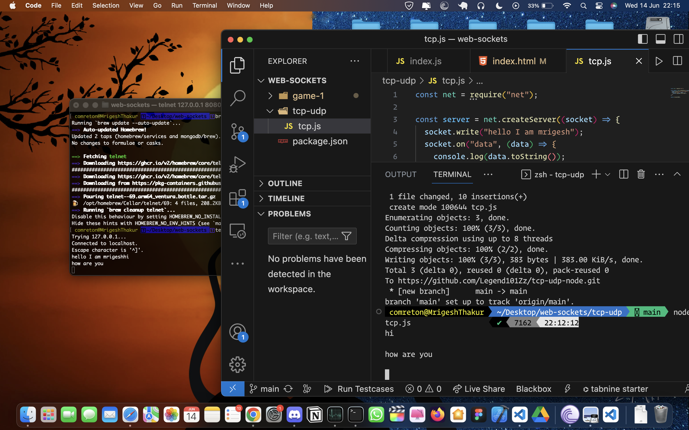

# Node TCP/UDP Connection Project

This is a small Node.js project that demonstrates TCP and UDP connections. It contains two separate code files, one for TCP connection and another for UDP connection.

## TCP Connection

The TCP (Transmission Control Protocol) connection is a reliable, connection-oriented protocol widely used for communication between clients and servers. TCP ensures the delivery of data by establishing a reliable channel and handling packet loss, reordering, and congestion control. The TCP connection code can be found in the file `tcp.js`.

To run the TCP connection code, follow these steps:

1. Open the `tcp.js` file and configure the TCP server details, such as the server IP address and port.

2. Run the TCP connection code by executing the following command:

   ```bash
   node tcp.js
   ```

   

## UDP Connection

The UDP (User Datagram Protocol) connection is a connectionless, lightweight protocol commonly used for quick data transmission without the need for establishing a reliable channel. UDP is often preferred for applications that prioritize speed over reliability, such as real-time streaming and gaming. The UDP connection code can be found in the file `udp.js`.

To run the UDP connection code, follow these steps:

1. Open the `udp.js` file and configure the UDP server details, such as the server IP address and port.

2. Run the UDP connection code by executing the following command:
   ```bash
   node udp.js
   ```


